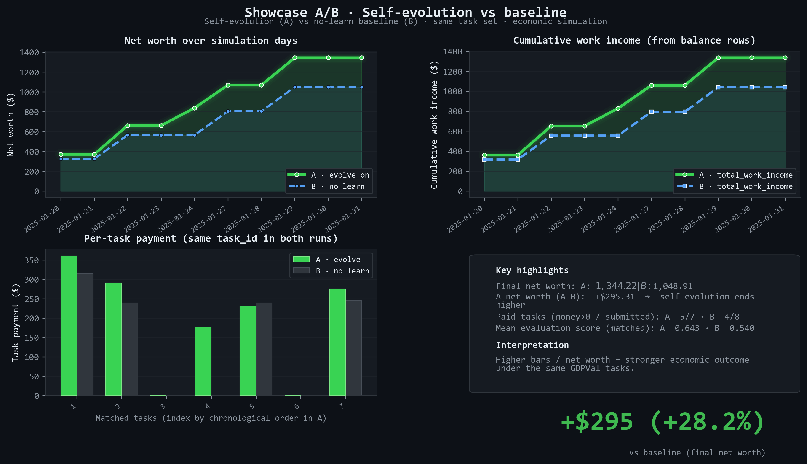
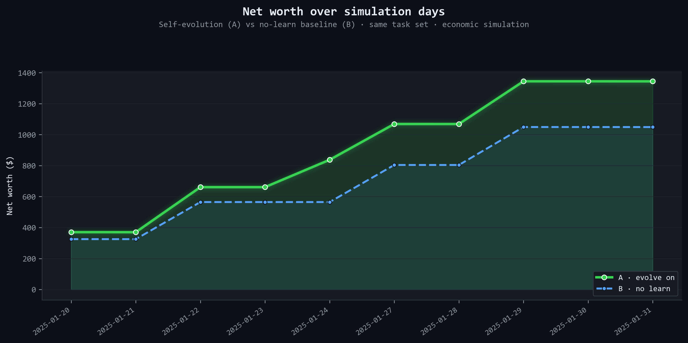

<p align="center">
  <h1 align="center">SelfEvolvingClaw</h1>
  <p align="center">
    
  </p>
  <p align="center">Create missing capabilities during execution · No fixed skill set required · Keep getting stronger</p>
  <p align="center"><strong>+28% net worth · 13 validated skills · 10-day A/B verified</strong></p>
  <p align="center"><em>GDPVal 10-day A/B experiment: self-evolving agent achieves ~28% higher net worth on identical tasks, 13 validated skills, no preset skill set.</em></p>
  <p align="center">
    
  </p>
  <p align="center">
    
    
  </p>
  <p align="center">
    <a href="README.md">English</a> | <a href="README_zh.md">中文</a>
  </p>
</p>

---

## Table of contents

- [🎯 Overview](#-overview)
- [✨ Why SelfEvolvingClaw?](#-why-selfevolvingclaw)
- [📊 Results](#-results)
- [🔄 How it works](#-how-it-works)
- [⚡ Core capabilities](#-core-capabilities)
- [💡 Design principles](#-design-principles)
- [📦 Setup & installation](#-setup--installation)
- [🚀 Quickstart](#-quickstart)
- [▶️ How to run](#️-how-to-run)
- [📁 Project structure](#-project-structure)
- [⚙️ Configuration](#️-configuration)
- [📚 Evolved skills example](#-evolved-skills-example)
- [❓ FAQ](#-faq)
- [📖 Learn more](#-learn-more)
- [🤝 Contributing & license](#-contributing--license)

---

## 🎯 Overview

**SelfEvolvingClaw** lets agents **create missing skills during execution**—so their capabilities improve over time instead of relying on a fixed, pre-written skill set. Given tasks and economic constraints, agents work, pay token costs, get evaluated, receive payments, and run a **Skill self-evolution loop** (Run1 → Learn → Run2 → skill consolidation).

---

## ✨ Why SelfEvolvingClaw?

| Feature | Defect | Description |
|------|------|------|
| **No preset skills** | Fixed prompts/skill sets; new tasks require manual additions | Capabilities are created at runtime, no preset skill set needed |
| **Learn from failure** | Failures lead to retries or tuning; no automatic extraction of reusable rules from feedback | Low score triggers Learn → extract rules & code → Run2 retry and validate |
| **Only persist valid skills** | Invalid skills/prompts accumulate; hard to maintain, prone to conflicts | Only skills actually used in Run2 with measurable improvement are written to `skills.jsonl` |
| **Economic constraints** | Focus on task completion only; no explicit cost–benefit modeling | Simulate balance, token costs, task income; drive rational decisions |
| **Experiment-backed** | Mostly concepts or demos; little reproducible quantitative comparison | 10-day A/B: ~+28% net worth on same tasks; 13 validated skills |

**Use cases**: Long-running agents that need to improve over time; new task types; decision-making under economic constraints.

---

## 📊 Results

10-day A/B experiment on GDPVal dataset: **identical task sequences**, same starting balance ($10). The only difference—self-evolution enabled vs. disabled.

| Metric | Evolve ON (A) | Evolve OFF (B) | Δ |
|--------|---------------|----------------|---|
| **Final net worth** | $1,344 | $1,049 | **+28%** |
| **Cumulative work income** | $1,335 | $1,040 | **+28%** |
| **Validated skills** | 13 | 0 | — |

<p align="center">
  
</p>

*Data from [experiments/ab_10d_evolution_funds/](experiments/ab_10d_evolution_funds/). Same 10 tasks, same order; A learns from low-score runs and persists skills used in Run2.*

---

## 🔄 How it works


**Closed loop**: Only skills that are actually used in Run2 and improve performance are persisted. No skill bloat.


## ⚡ Core capabilities

| Capability | Description |
|------|------|
| **Task orchestration** | `task_id` / `sector` / `occupation` / `prompt` / `reference_files`; supports inline, JSONL, or GDPVal sources. |
| **Session scheduling** | Daily work/learn sessions; supports single-day, multi-day, and exhaust mode. |
| **Economic constraints** | Balance, token costs, task income, and survival status tracking to drive rational decisions. |
| **Evaluation & feedback** | LLM scoring and structured feedback based on `eval/meta_prompts`. |
| **Skill self-evolution** | Per-agent `skill/skills.jsonl` plus candidate `candidates.jsonl`; scripts orchestrate Run1→Learn→Run2 and persist validated skills. |

---

## 💡 Design principles

- **🔄 Closed-loop evolution**: If performance is poor, automatically insert a Learn session; only write skills that are actually used and validated in Run2 to `skills.jsonl`.
- **📂 Isolated runs**: Evolution scripts generate run1/learn/run2 configs under isolated directories.
- **📌 Reproducible**: Config-driven; dates and tasks can be fixed for reproducibility and comparison.

Three typical usage paths:

| Scenario | Description |
|------|------|
| **Single / two-day tasks** | Run the full pipeline with inline tasks: execute → deliver → evaluate → settle economics; can trigger skills. |
| **Multi-day tasks** | Run over a date range with multi-day economic constraints (GDPVal or inline/JSONL). |
| **Skill self-evolution** | Use `single_task_evolve.py` to orchestrate Run1 → Learn → Run2 and write back validated skills. |

---

## 📦 Setup & installation

- **Python** ≥ 3.10
- Configure API keys (agent + evaluator). See [.env.example](.env.example)

```bash
# After cloning or extracting, run from the project root
pip install -r requirements.txt
```

💡 Recommended: use a virtual environment.

```bash
python -m venv .venv
source .venv/bin/activate   # Linux/macOS
# or .venv\Scripts\activate  # Windows
pip install -r requirements.txt
```

⚠️ Copy the env template and fill in your keys (**do not commit** `.env` to the repo).

```bash
cp .env.example .env
# Edit .env and fill in OPENAI_API_KEY, EVALUATION_API_KEY, etc.
```

**Optional system dependencies** (for full PDF/PPTX image support; fallbacks exist if missing):

| Platform | Package | Purpose |
|----------|---------|---------|
| Linux | `poppler-utils` | PDF → images (`apt install poppler-utils`) |
| Linux | `libreoffice` | PPTX → images (`apt install libreoffice`) |
| Windows | [Poppler](https://github.com/osber/poppler-windows/releases) | Set `POPPLER_PATH` to `.../Library/bin` in `.env` |

---

## 🚀 Quickstart

Run all commands from the **repository root** so relative paths resolve correctly.

### 1️⃣ Single / two-day tasks (full pipeline + skills)

Use built-in config `livebench/configs/simple_task_config.json` (2 days, 2 inline tasks; Run1 doesn't use skills; Run2 requires calling `get_skill_content` before submitting).

```bash
python livebench/main.py livebench/configs/simple_task_config.json
```

### 2️⃣ Multi-day tasks (e.g., 10 days)

```bash
python livebench/main.py livebench/configs/default_config.json
```

When not using GDPVal, set `task_source.type: "inline"` or `"jsonl"` in the config.

### 3️⃣ Skill evolution (Run1 → Learn → Run2)

```bash
python scripts/single_task_evolve.py \
  --config-run1 livebench/configs/single_task_debug_run1.json \
  --config-run2 livebench/configs/single_task_debug_run2.json
```

The script generates `run1.json` / `learn.json` / `run2.json` under an isolated directory and forces `evolution.enabled=false`.

---

## ▶️ How to run

| Purpose | Command |
|------|------|
| Single / two-day tasks | `python livebench/main.py livebench/configs/simple_task_config.json` |
| Multi-day tasks | `python livebench/main.py livebench/configs/default_config.json` |
| Self-evolution | `python scripts/single_task_evolve.py --config-run1 livebench/configs/single_task_debug_run1.json --config-run2 livebench/configs/single_task_debug_run2.json` |

Override dates via env vars (must match the dates in the config).

```bash
# Windows (PowerShell)
$env:INIT_DATE="2025-01-20"; $env:END_DATE="2025-01-21"
python livebench/main.py livebench/configs/simple_task_config.json

# Linux/macOS
INIT_DATE=2025-01-20 END_DATE=2025-01-21 python livebench/main.py livebench/configs/simple_task_config.json
```

---

## 📁 Project structure

```
.
├── livebench/           # core framework
│   ├── main.py          # entrypoint
│   ├── agent/           # agent runtime
│   ├── work/            # task selection, submission, evaluation
│   ├── skill/           # skill storage & tools
│   ├── tools/           # MCP / tools
│   ├── configs/         # configs (single-day, multi-day, evolution templates)
│   └── data/            # runtime data (agent_data, single_task_debug/runs)
├── eval/                # evaluation
│   └── meta_prompts/    # scoring rubrics
├── scripts/             # scripts
│   ├── single_task_evolve.py   # evolution workflow
│   ├── plot_ab_showcase_github_style.py  # A/B figure generation
│   └── task_value_estimates/   # task pricing (optional)
├── experiments/         # experiments (e.g. ab_10d_evolution_funds A/B)
├── docs/                # docs
├── .env.example         # env template
├── requirements.txt
└── LICENSE
```

---

## ⚙️ Configuration

Configs are JSON. Common fields:

| Field | Description |
|------|------|
| `date_range.init_date` / `end_date` | Date range; same value means single-day. |
| `task_source.type` | `inline` or `jsonl`; inline is sufficient when not using GDPVal. |
| `task_source.tasks` | Task list for inline source. |
| `agents` | Agent list (`signature`, `basemodel`, etc.). |
| `skill.enabled` / `skill.use_builtin` | Enable skills and built-in skills. |
| `evolution.enabled` / `evolution.threshold` | Enable evolution and score threshold. |
| `evaluation.meta_prompts_dir` | Evaluation directory, usually `./eval/meta_prompts`. |
| `data_path` | Agent data root, default `./livebench/data/agent_data`. |

---

## 📚 Evolved skills example

Below is a **technical** skill evolved from the above tasks (extracted from Learn after a low-score task), showing the actual content produced by self-evolution:

---

### Skill: Creating Professional Stage Plot Graphics with Python

**Type**: technical · **Source**: Stage plot task failure → Learn extraction

**When to use**: Tasks requiring stage diagrams exported as PDF; drawing standardized icons for mics, DI boxes, amps, monitors; generating touring advance documents.

**Core principles**:
1. Use **matplotlib** for the diagram—precise control over shapes, positions, and scaling
2. Use **reportlab** to embed figures into PDF documents
3. Landscape layout (width > height); 1 unit ≈ 2–3 feet
4. Consistent icon sizes: mics/DIs ~0.3, amps ~1.0×0.6, wedges ~0.5

**Icon drawing standards**:

| Item | Shape | Color | Size reference |
|------|-------|-------|----------------|
| Vocal mic | Circle + X | Black fill | radius=0.15 |
| DI box | Small rectangle | Gray fill | 0.2 × 0.15 |
| Guitar/Bass amp | Rectangle | Black outline | 0.6 × 0.4 |
| Monitor wedge | Triangle (pointing up) | Blue fill | base=0.4, height=0.3 |
| IEM transmitter | Small square | Green fill | 0.15 × 0.15 |

**Layout**: Label Stage Right/Left; Front-of-Stage at bottom; ≥1.5 units between performers; wedges facing performer at ~45°.

**Code skeleton** (matplotlib + reportlab):

```python
import numpy as np
import matplotlib.pyplot as plt
from matplotlib.patches import Circle, Rectangle, Polygon
import io
from reportlab.lib.pagesizes import landscape, letter
from reportlab.platypus import SimpleDocTemplate, Image, Table

def draw_wedge(ax, x, y, angle=0, label=None, color='#4169E1'):
    """Draw monitor wedge icon (triangle)"""
    triangle = np.array([[0, 0.3], [-0.25, -0.2], [0.25, -0.2]])
    theta = np.radians(angle)
    rotation = np.array([[np.cos(theta), -np.sin(theta)], [np.sin(theta), np.cos(theta)]])
    wedge = Polygon(np.dot(triangle, rotation.T) + [x, y], facecolor=color, edgecolor='black')
    ax.add_patch(wedge)
    if label:
        ax.text(x, y-0.35, label, ha='center', fontsize=7)
```

**Critical reminder**: Every item in the Input List and Output List must have a corresponding icon on the stage plot, or the deliverable is incomplete.

---

## ❓ FAQ

**Q: Can I run without GDPVal?**  
Yes. **GDPVal is optional.** When you don't have the GDPVal dataset:

- **Inline tasks**: Set `task_source.type: "inline"` and provide `task_source.tasks` in the config (see [simple_task_config.json](livebench/configs/simple_task_config.json)).
- **JSONL tasks**: Set `task_source.type: "jsonl"` and point `task_source.path` to a JSONL file where each line is a task object with `task_id`, `sector`, `occupation`, `prompt`, and optional `reference_files`.

Both modes support the full pipeline (work → evaluate → economics → skills). Use inline for quick validation; use JSONL for batch tasks.

**Q: How do I add custom tasks?**  
For `inline` source: add objects with `task_id`, `sector`, `occupation`, `prompt`, and optional `reference_files` to `task_source.tasks`. For `jsonl`: point `task_source.path` to a JSONL file with the same fields per line.

**Q: Where are skills stored, and how do I inspect them?**  
Per-agent skills: `livebench/data/agent_data/<signature>/skill/skills.jsonl`. Candidates: `candidates.jsonl` in the same directory. The agent can call `get_skills` and `get_skill_content(name)` during runs. You can also read the JSONL files directly.

**Q: How do I reproduce the A/B experiment?**  
Use fixed `date_range` and `task_assignment.task_ids` in both A and B configs. Run A with `evolution.enabled=true`, B with `evolution.enabled=false`. Use different `signature` values so data dirs are isolated. See [experiments/ab_10d_evolution_funds/](experiments/ab_10d_evolution_funds/).

**Q: Skills were not written back after Learn?**  
Only skills that are actually used in Run2 (and Run2 improves over Run1) will be promoted to the main `skills.jsonl`.

---

## 📖 Learn more

| Resource | Description |
|----------|-------------|
| [experiments/ab_10d_evolution_funds/](experiments/ab_10d_evolution_funds/) | 10-day A/B experiment setup, configs, and data |
| [livebench/configs/](livebench/configs/) | Config examples: inline tasks, multi-day, evolution |

**Next steps**: Run the [Quickstart](#-quickstart) with `simple_task_config.json` → try `single_task_evolve.py` for Run1→Learn→Run2 → reproduce the A/B experiment with your own `task_ids`.

---

## 🤝 Contributing & license

Contributions are welcome. How to participate:

- **Bug reports & feature requests**: Open an issue with a clear description.
- **Code contributions**: Fork, create a branch, submit a PR. See [CONTRIBUTING.md](CONTRIBUTING.md) for PR workflow, code style, and testing. Include config notes and sanitized logs if applicable.
- **Security**: Do not commit `.env` or runtime data. Keep API keys and secrets out of the repo.

📄 Licensed under **MIT**. See [LICENSE](LICENSE).
