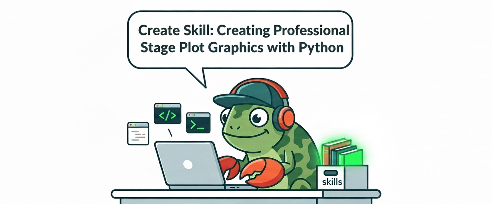
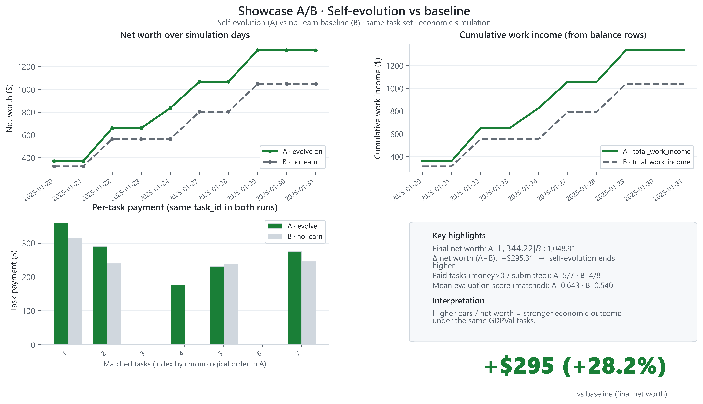
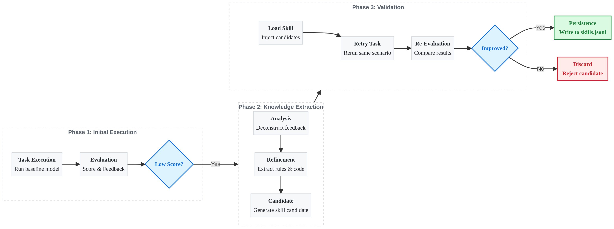

<p align="center">
  
</p>
<h1 align="center">CamoClaw: Your Self-Evolving AI Coworker</h1>
<p align="center">
  
  
  
</p>
🦎 CamoClaw：拓展任务边界，在执行中沉淀领域技能。

⚡️ 相较静态技能库 Agent，CamoClaw 综合表现提升 28%。

📏 可复现：运行 <code>python camoclaw/main.py camoclaw/configs/default_config.json</code> 即可验证。

<p align="center">
  
</p>

  <p align="center">
    <a href="README.md">English</a> | <a href="README_zh.md">中文</a>
  </p>

---

## 📢 News

2026-03-20 🚀 **正式发布** — 自进化 AI Agent：零预设、执行中沉淀技能、Run1→Learn→Run2 闭环、经济约束驱动。详见 [概述](#-概述)。

---

## ✨ CamoClaw 核心特点

💼 **多 sector 职业任务**：支持多样化真实世界任务——inline、JSONL 或 GDPVal 任务源，支持 sector/occupation 元数据编排。

💸 **经济约束模拟**：余额、token 成本与任务报酬驱动理性决策。每笔 API 调用计费；收入仅来自高质量交付物。

🦎 **零预设、技能沉淀**：无固定技能集。能力在运行时自造；低分触发 Learn → 提炼规则与代码 → Run2 重试验证。

📦 **闭环技能沉淀**：仅在 Run2 中实际使用且带来提升的技能才写入 `skills.jsonl`。无无效堆积。

📊 **端到端工作流**：任务分配 → 执行 → 产出 → LLM 评估 → 结算——完整专业流水线。

⚖️ **分 sector 的 LLM 评估**：按 sector 定制评估 rubric——确保评估贴合真实专业标准。

---

## 目录

- [🎯 概述](#-概述)
- [📦 环境与安装](#-环境与安装)
- [🚀 快速开始](#-快速开始)
- [📊 效果数据](#-效果数据)
- [🔄 工作原理](#-工作原理)
- [⚡ 核心能力](#-核心能力)
- [💡 设计理念](#-设计理念)
- [▶️ 运行方式](#️-运行方式)
- [📁 项目结构](#-项目结构)
- [⚙️ 配置说明](#️-配置说明)
- [📚 自进化技能示例](#-自进化技能示例)
- [❓ 常见问题](#-常见问题)
- [📖 进阶阅读](#-进阶阅读)
- [🤝 贡献与许可](#-贡献与许可)

---

## 🎯 概述

**CamoClaw**：让 Agent 在**执行过程中创造自己缺失的 skill**，随着时间推移能力逐步变强，而非依赖事先写死的技能集。在给定任务与经济约束下，Agent 执行工作、承担 token 成本、通过评估获得报酬，并运行 **Skill 自进化** 闭环（Run1 → Learn → Run2 → 技能沉淀）。

---

## 📦 环境与安装

- **Python** ≥ 3.10
- 需配置 API Key（Agent 与评估模型），见 [.env.example](.env.example)

```bash
# 克隆或解压本仓库后，在项目根目录执行
pip install -r requirements.txt
```

💡 建议使用虚拟环境：

```bash
python -m venv .venv
source .venv/bin/activate   # Linux/macOS
# 或 .venv\Scripts\activate  # Windows
pip install -r requirements.txt
```

⚠️ 复制环境变量模板并填写密钥（**请勿将 `.env` 提交至仓库**）：

```bash
cp .env.example .env
# 编辑 .env，填入 OPENAI_API_KEY、EVALUATION_API_KEY 等
```

**可选系统依赖**（用于 PDF/PPTX 转图；缺失时有文本回退）：

| 平台 | 包 | 用途 |
|------|-----|------|
| Linux | `poppler-utils` | PDF 转图（`apt install poppler-utils`） |
| Linux | `libreoffice` | PPTX 转图（`apt install libreoffice`） |
| Windows | [Poppler](https://github.com/osber/poppler-windows/releases) | 在 `.env` 中设置 `POPPLER_PATH` 为 `.../Library/bin` |

---

## 🚀 快速开始

所有命令均在 **项目根目录** 下执行，以保证相对路径正确。

### 1️⃣ 单日/两日任务（完整流水线 + Skill）

使用内置配置 `camoclaw/configs/simple_task_config.json`（2 天、2 个 inline 任务；Run1 不调用技能，Run2 需先调用 `get_skill_content` 再提交）：

```bash
python camoclaw/main.py camoclaw/configs/simple_task_config.json
```

### 2️⃣ 多日任务（如 10 天）

```bash
python camoclaw/main.py camoclaw/configs/default_config.json
```

未使用 GDPVal 时，在配置中设置 `task_source.type: "inline"` 或 `"jsonl"` 即可。

### 3️⃣ Skill 自进化（Run1 → Learn → Run2）

```bash
python scripts/single_task_evolve.py \
  --config-run1 camoclaw/configs/single_task_debug_run1.json \
  --config-run2 camoclaw/configs/single_task_debug_run2.json
```

脚本在隔离目录下生成 `run1.json` / `learn.json` / `run2.json`，并强制 `evolution.enabled=false`。

---

## 📊 效果数据

GDPVal 数据集 10 天 A/B 实验：**完全相同的任务序列**（每天一个真实任务）、相同初始余额（$10）。唯一差异——是否开启自进化。

| 指标 | 自进化开启 (A) | 自进化关闭 (B) | Δ |
|------|----------------|----------------|---|
| **最终净值** | $1,344 | $1,049 | **+28%** |
| **累计工作收入** | $1,335 | $1,040 | **+28%** |
| **有效技能数** | 13 | 0 | — |

<p align="center">
  
</p>

*数据来自 [experiments/ab_10d_evolution_funds/](experiments/ab_10d_evolution_funds/)。相同 10 个任务、相同顺序；A 组从低分任务中学习，并将 Run2 中实际使用的技能持久化。*

---

## 🔄 工作原理

<p align="center">
  
</p>

**闭环原则**：仅当技能在 Run2 中被实际使用且带来提升时，才会持久化。避免无效技能堆积。


## ⚡ 核心能力

| 能力 | 说明 |
|------|------|
| **任务编排** | `task_id` / `sector` / `occupation` / `prompt` / `reference_files`，支持 inline、jsonl 或 GDPVal 任务源。 |
| **会话调度** | 按日执行工作或学习会话，支持单日、多日与 exhaust 模式。 |
| **经济约束** | 余额、token 成本、任务报酬与生存状态追踪，驱动理性决策。 |
| **评估与反馈** | 基于 `eval/meta_prompts` 的评估标准进行 LLM 打分与结构化反馈。 |
| **技能自进化** | 每 Agent 独立 `skill/skills.jsonl` 与候选 `candidates.jsonl`，由脚本统一编排 Run1→Learn→Run2 流程并写回有效技能。 |

---

## 💡 设计理念

- **🔄 闭环进化**：任务表现不佳时自动插入 Learn 会话，在 Run2 确认有效后将实际用到的技能写入 `skills.jsonl`，避免无效技能堆积。
- **📂 隔离运行**：自进化脚本在隔离目录下生成 run1/learn/run2 配置。
- **📌 可复现**：配置驱动、日期与任务可固定，便于复现与对比不同策略。

三种典型使用路径：

| 场景 | 说明 |
|------|------|
| **单日/两日任务** | 使用 inline 任务跑通完整流水线：执行 → 交付 → 评估 → 经济结算，并可触发 skill 机制。 |
| **多日任务** | 按日期区间运行，多日经济约束下的任务完成（可选 GDPVal 或 inline/jsonl）。 |
| **Skill 自进化** | 通过 `single_task_evolve.py` 编排 Run1 → Learn → Run2，将 Run2 确认有效的技能写回主目录。 |

---

## ▶️ 运行方式

| 用途 | 命令 |
|------|------|
| 单日/两日任务 | `python camoclaw/main.py camoclaw/configs/simple_task_config.json` |
| 多日任务 | `python camoclaw/main.py camoclaw/configs/default_config.json` |
| 自进化 | `python scripts/single_task_evolve.py --config-run1 camoclaw/configs/single_task_debug_run1.json --config-run2 camoclaw/configs/single_task_debug_run2.json` |

可通过环境变量覆盖配置中的日期（需与配置内日期一致）：

```bash
# Windows (PowerShell)
$env:INIT_DATE="2025-01-20"; $env:END_DATE="2025-01-21"
python camoclaw/main.py camoclaw/configs/simple_task_config.json

# Linux/macOS
INIT_DATE=2025-01-20 END_DATE=2025-01-21 python camoclaw/main.py camoclaw/configs/simple_task_config.json
```

---

## 📁 项目结构

```
.
├── camoclaw/           # 主框架
│   ├── main.py          # 入口
│   ├── agent/           # Agent 与运行逻辑
│   ├── work/            # 任务选择、交付、评估
│   ├── skill/           # 技能存储与工具
│   ├── tools/           # MCP / 工具
│   ├── configs/         # 配置（单日、多日、进化模板）
│   └── data/            # 运行数据（agent_data、single_task_debug/runs）
├── eval/                # 评估
│   └── meta_prompts/    # 评分标准
├── scripts/             # 脚本
│   ├── single_task_evolve.py   # 自进化流程
│   ├── plot_ab_showcase_github_style.py  # A/B 出图
│   └── task_value_estimates/   # 任务定价（可选）
├── experiments/         # 实验（如 ab_10d_evolution_funds A/B）
├── docs/                # 设计文档
├── .env.example         # 环境变量模板
├── requirements.txt
└── LICENSE
```

---

## ⚙️ 配置说明

配置文件为 JSON。常用字段：

| 字段 | 说明 |
|------|------|
| `date_range.init_date` / `end_date` | 日期区间；起止相同即为单日。 |
| `task_source.type` | `inline` 或 `jsonl`，不依赖 GDPVal 时可仅用 inline。 |
| `task_source.tasks` | inline 时的任务列表。 |
| `agents` | Agent 列表（`signature`、`basemodel` 等）。 |
| `skill.enabled` / `skill.use_builtin` | 是否启用技能及内置技能。 |
| `evolution.enabled` / `evolution.threshold` | 是否在主流程中启用进化及分数阈值。 |
| `evaluation.meta_prompts_dir` | 评估目录，通常为 `./eval/meta_prompts`。 |
| `data_path` | Agent 数据根目录，默认 `./camoclaw/data/agent_data`。 |

---

## 📚 自进化技能示例

以下为 Agent 在上述任务中沉淀的 **技术类技能** 示例（来自低分任务后的 Learn 提炼），展示自进化产出的实际内容：

---

### Skill: 用 Python 生成专业舞台图（Stage Plot）

**类型**：technical · **来源**：舞台图任务失败 → Learn 提炼

**适用场景**：需要将舞台图导出为 PDF 的任务；绘制麦克风、DI 盒、监听等标准化图标；生成巡演 advance 文档。

**核心原则**：
1. 用 **matplotlib** 绘制舞台图，精确控制形状、位置与缩放
2. 用 **reportlab** 将图嵌入 PDF，生成专业文档
3. 横版布局（width > height），1 单位 ≈ 2–3 英尺
4. 图标尺寸统一：麦克风/DI 小圆 ~0.3，功放矩形 ~1.0×0.6，监听三角 ~0.5

**图标绘制规范**：

| 设备 | 形状 | 颜色 | 尺寸参考 |
|------|------|------|----------|
| 人声麦克风 | 圆 + X | 黑填充 | radius=0.15 |
| DI 盒 | 小矩形 | 灰填充 | 0.2 × 0.15 |
| 吉他/贝斯功放 | 矩形 | 黑边框 | 0.6 × 0.4 |
| 监听楔 | 三角形（朝上） | 蓝填充 | base=0.4, height=0.3 |
| IEM 发射器 | 小方块 | 绿填充 | 0.15 × 0.15 |

**布局要点**：Stage Right/Left 标注、Front-of-Stage 在底部、乐手间距 ≥1.5 单位、监听朝向乐手约 45°。

**代码骨架**（matplotlib + reportlab）：

```python
import numpy as np
import matplotlib.pyplot as plt
from matplotlib.patches import Circle, Rectangle, Polygon
import io
from reportlab.lib.pagesizes import landscape, letter
from reportlab.platypus import SimpleDocTemplate, Image, Table

def draw_wedge(ax, x, y, angle=0, label=None, color='#4169E1'):
    """绘制监听楔图标（三角形）"""
    triangle = np.array([[0, 0.3], [-0.25, -0.2], [0.25, -0.2]])
    theta = np.radians(angle)
    rotation = np.array([[np.cos(theta), -np.sin(theta)], [np.sin(theta), np.cos(theta)]])
    wedge = Polygon(np.dot(triangle, rotation.T) + [x, y], facecolor=color, edgecolor='black')
    ax.add_patch(wedge)
    if label:
        ax.text(x, y-0.35, label, ha='center', fontsize=7)
```

**关键提醒**：Input List 与 Output List 中的每一项都必须在舞台图上有对应图标，否则视为不完整。

---

## ❓ 常见问题

**Q：没有 GDPVal 数据集可以运行吗？**  
可以。**GDPVal 为可选。** 无 GDPVal 时：

- **Inline 任务**：设置 `task_source.type: "inline"`，在配置中提供 `task_source.tasks`（参考 [simple_task_config.json](camoclaw/configs/simple_task_config.json)）。
- **JSONL 任务**：设置 `task_source.type: "jsonl"`，将 `task_source.path` 指向 JSONL 文件，每行一个任务对象，包含 `task_id`、`sector`、`occupation`、`prompt`，可选 `reference_files`。

两种模式均支持完整流水线（工作 → 评估 → 经济结算 → 技能）。Inline 适合快速验证；JSONL 适合批量任务。

**Q：如何添加自定义任务？**  
`inline` 模式：在 `task_source.tasks` 中添加对象，包含 `task_id`、`sector`、`occupation`、`prompt`，可选 `reference_files`。`jsonl` 模式：将 `task_source.path` 指向包含相同字段的 JSONL 文件。

**Q：技能存在哪里，如何查看？**  
每 Agent 技能：`camoclaw/data/agent_data/<signature>/skill/skills.jsonl`。候选技能：同目录下的 `candidates.jsonl`。运行中 Agent 可调用 `get_skills`、`get_skill_content(name)`。也可直接读取 JSONL 文件。

**Q：如何复现 A/B 实验？**  
在 A、B 配置中固定 `date_range` 和 `task_assignment.task_ids`。A 组 `evolution.enabled=true`，B 组 `evolution.enabled=false`。使用不同 `signature` 以隔离数据目录。详见 [experiments/ab_10d_evolution_funds/](experiments/ab_10d_evolution_funds/)。

**Q：Learn 之后技能没有写入主目录的 skills.jsonl？**  
请确认：仅有 run2 的结果相较 run1 有提升，且在 run2 中实际使用到的 skill 才会添加到主目录。

---

## 📖 进阶阅读

| 资源 | 说明 |
|------|------|
| [experiments/ab_10d_evolution_funds/](experiments/ab_10d_evolution_funds/) | 10 天 A/B 实验配置、运行与数据 |
| [camoclaw/configs/](camoclaw/configs/) | 配置示例：inline 任务、多日、自进化 |

**下一步**：用 [快速开始](#-快速开始) 跑通 `simple_task_config.json` → 尝试 `single_task_evolve.py` 完成 Run1→Learn→Run2 → 用自有 `task_ids` 复现 A/B 实验。

---

## 🤝 贡献与许可

欢迎贡献。参与方式：

- **Bug 报告与功能建议**：提交 Issue，说明问题或需求。
- **代码贡献**：Fork、创建分支、提交 PR 后发起合并。详见 [CONTRIBUTING.md](CONTRIBUTING.md) 中的 PR 流程、代码风格与测试方式。PR 中建议附带配置说明与脱敏日志。
- **安全提醒**：请勿提交 `.env` 及运行数据，API 密钥与敏感信息不应进入仓库。

📄 本仓库采用 **MIT** 许可，详见 [LICENSE](LICENSE)。

