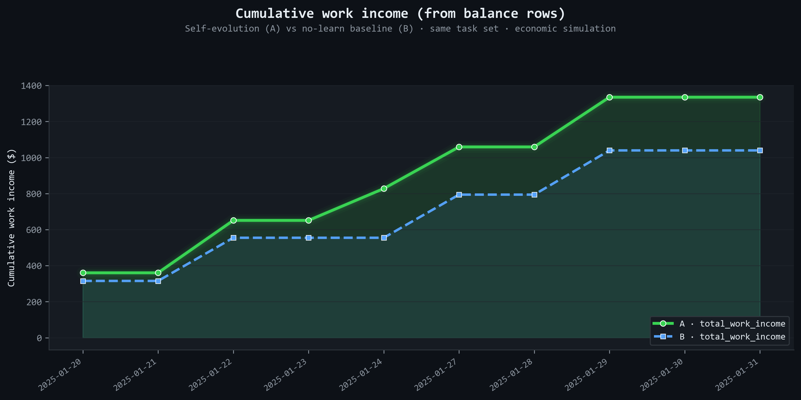
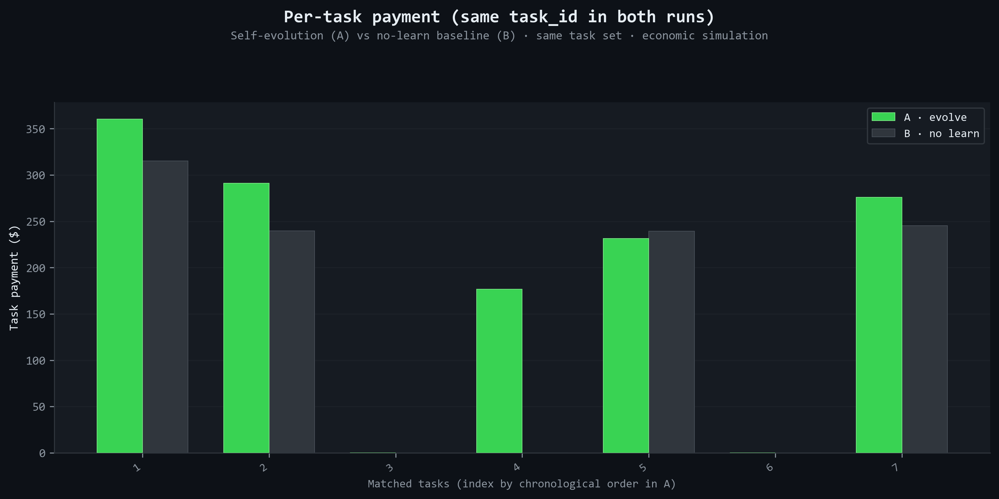

## 10-Day Fund Curve A/B Experiment (GDPVal)

This directory is for **10 working days** fund curve comparison experiments:

- **Group A (Evolve ON)**: Self-evolution enabled (Learn + Run2 + skill consolidation)
- **Group B (Evolve OFF)**: Self-evolution disabled

Core requirements:

- **Both groups receive identical task sequences** (same task_id list, same order)
- **Both groups perform "work" every day** (i.e., deliver and submit the day's task each day)

---

## Directory structure

- `configs/`
  - `A_showcase_10d_evolve_on.json`: Group A config template
  - `B_showcase_10d_no_learn.json`: Group B config template
- `task_ids_10.json`: 10 GDPVal `task_id`s to fill in (order = execution order)

---

## 1) Prepare 10 task_ids (ensure A/B consistency)

Open and edit `task_ids_10.json`, replace placeholders with real GDPVal task IDs (10 total, order fixed).

### Task selection tips (for experiment notes)

- Prefer tasks in **similar difficulty range** (avoid all trivial or all very hard)
- Avoid tasks with severely missing or long-unavailable reference files (causes "cannot submit", breaks "daily work" constraint)

---

## How to reproduce A/B experiment with task_ids_10.json

1. **Edit `task_ids_10.json`**: Fill in 10 GDPVal `task_id`s; order = execution order.
2. **Sync to A/B configs**: Copy the `task_ids` array from `task_ids_10.json` **as-is** into `agents[0].task_assignment.task_ids` in both `configs/A_showcase_10d_evolve_on.json` and `configs/B_showcase_10d_no_learn.json`, ensuring A and B have **identical** task sequences.
3. **Run Group A** (evolution on):
   ```powershell
   python camoclaw/main.py experiments/ab_10d_evolution_funds/configs/A_showcase_10d_evolve_on.json
   ```
4. **Run Group B** (evolution off):
   ```powershell
   python camoclaw/main.py experiments/ab_10d_evolution_funds/configs/B_showcase_10d_no_learn.json
   ```
5. **Plot**: Use `scripts/plot_ab_showcase_github_style.py` to generate comparison figures (configure A/B `data_path` or `signature` as needed).

> If using a custom `task_ids_10.json`, ensure `gdpval_path` points to the GDPVal directory containing the corresponding parquet files.

---

## 2) Config notes (A/B differ only by evolution switch)

Both configs use:

- `gdpval_path: "./gdpval"` as task source (GDPVal parquet)
- `task_assignment.mode: "sequential"` + `task_assignment.task_ids` for fixed task sequence (from `task_ids_10.json`)
- `tasks_per_day: 1` (one task per day)
- Different `signature` per group for data isolation (avoids "resume skipping dates")

Difference:

- A: `evolution.enabled=true` (evolution on)
- B: `evolution.enabled=false` (evolution off)

---

## 3) Date range: ensuring 10 working days

The main flow runs **weekdays only (Mon–Fri)** by default.

Set `date_range` to span two weeks so it includes at least 10 working days. For example:

- `init_date`: Monday
- `end_date`: Friday two weeks later

Weekends are skipped automatically; `task_assignment.task_ids` is consumed in order.

---

## 4) Run commands (PowerShell)

From the project root:

```powershell
python camoclaw/main.py experiments/ab_10d_evolution_funds/configs/A_showcase_10d_evolve_on.json
python camoclaw/main.py experiments/ab_10d_evolution_funds/configs/B_showcase_10d_no_learn.json
```

---

## 5) "Daily work" constraint (important)

The framework lets the agent call `decide_activity(work|learn)` at the start of each day; it may choose learn.

This experiment's configs bias strongly toward daily work (but cannot guarantee 100% without code changes):

- `economic.initial_balance` is set low so the agent tends to work for income
- Task sequence uses GDPVal "real tasks"; work income usually aligns with survival goals

If you need **strict daily work** (regardless of agent choice), consider adding an experiment switch such as `force_activity="work"` to skip/override `decide_activity` in the daily session. This directory does not include that code change.

---

## 6) Where plot data comes from

Core data for each group:

`camoclaw/data/agent_data/<signature>/economic/`

and:

`camoclaw/data/agent_data/<signature>/economic/task_completions.jsonl`

Extract per working day:

- Balance
- Daily cost
- Work income
- (Group A only) Evolution trigger dates (from terminal/activity logs)

Use `scripts/plot_ab_showcase_github_style.py` to generate A/B comparison figures. Default DPI is 700 for sharp display on retina/high-DPI screens. For the README 4-in-1 figure to display well in both light and dark mode, run with `--combined-out` and `--combined-both-styles` to produce both dark and light variants. Use `--dpi 800` or higher for even crisper output. Example:

<p align="center">
  
  
  
</p>
